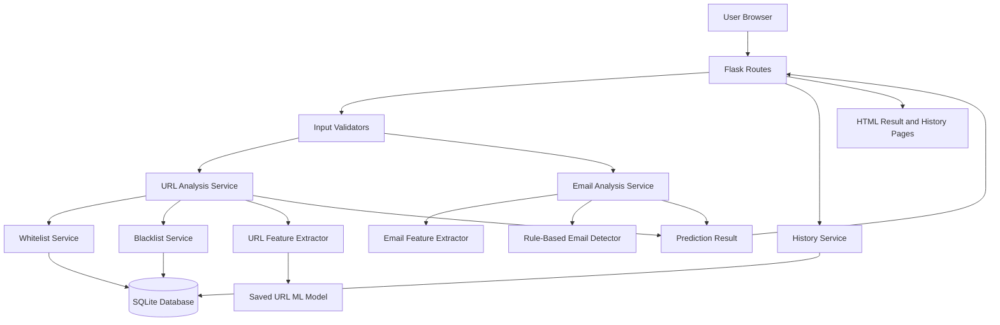

# Architecture Diagram

This Mermaid diagram can be pasted directly into GitHub, Mermaid Live, or a report tool that supports Mermaid.

```mermaid
flowchart TD
    U[User Browser] --> F[Flask Routes]
    F --> V[Input Validators]
    V --> URL[URL Analysis Service]
    V --> EMAIL[Email Analysis Service]

    URL --> WL[Whitelist Service]
    URL --> BL[Blacklist Service]
    URL --> FE[URL Feature Extractor]
    FE --> MODEL[Saved URL ML Model]

    EMAIL --> EFE[Email Feature Extractor]
    EMAIL --> RULES[Rule-Based Email Detector]

    WL --> DB[(SQLite Database)]
    BL --> DB
    F --> HISTORY[History Service]
    HISTORY --> DB

    URL --> R[Prediction Result]
    EMAIL --> R
    R --> F
    F --> UI[HTML Result and History Pages]
```
